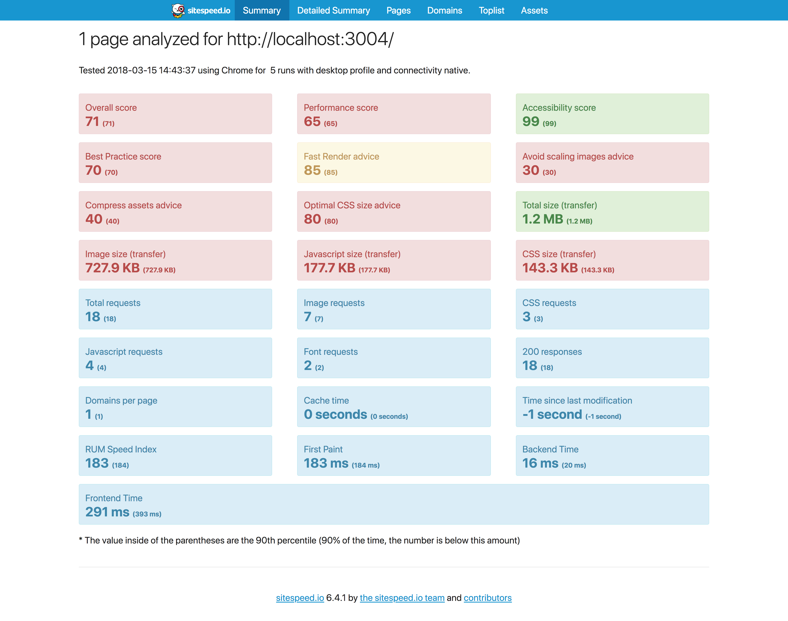
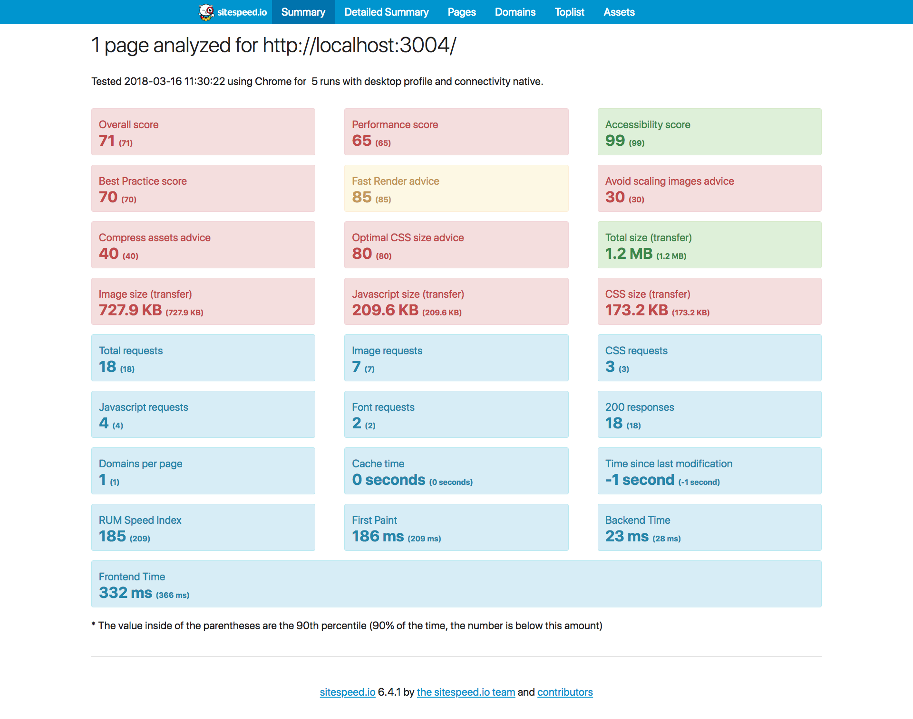
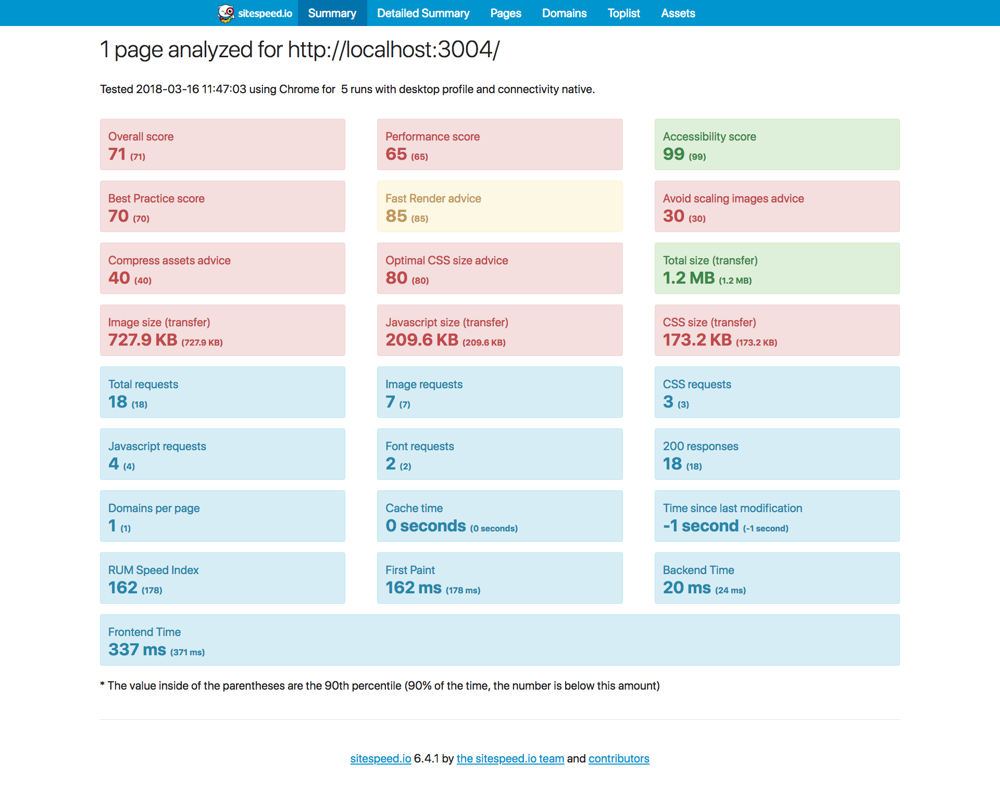

# Performance matters

## Project setup

This project serves an adapted version of the [Bootstrap documentation website](http://getbootstrap.com/). It is based on the [github pages branche of Bootstrap](https://github.com/twbs/bootstrap/tree/gh-pages).

Differences from actual Bootstrap documentation:

- Added custom webfont
- Removed third party scripts
- The src directory is served with [Express](https://expressjs.com/).
- Templating is done with [Nunjucks](https://mozilla.github.io/nunjucks/)

## Getting started

- Install dependencies: `npm install`
- Install Submodules: `git submodules init && git submodules update`
- Install packages for sitespeed `cd sitespeed && npm install`
- Serve: `npm start`
- Run speedtest `sitespeed/bin/sitespeed.js http://localhost:3004/`
- Expose localhost: `npm run expose`

## Performance improvements

#### First Test Run ([Master](https://github.com/Casburggraaf/performance-matters/tree/master))
This test is runned without any improvements.

Or see [Detail page](http://htmlpreview.github.io/?https://raw.githubusercontent.com/Casburggraaf/performance-matters/tree/master/sitespeed-result/localhost/2018-03-15-14-18-04/detailed.html)

#### CSS and JS Minification ([minify](https://github.com/Casburggraaf/performance-matters/tree/feature/minify))
This test is runned with minifycation of css and js, with the tool[minifier](https://github.com/fizker/minifier) .
The Changes are minimal but this practice is a easy win without any setbacks

Or see [Detail page](http://htmlpreview.github.io/?https://raw.githubusercontent.com/Casburggraaf/performance-matters/tree/master/sitespeed-result/localhost/2018-03-15-14-43-37/detailed.html)

#### Subse Fonts ([subset-fonts](https://github.com/Casburggraaf/performance-matters/tree/feature/subset-fonts))
This test is runned with the subset of the fonts, this delets al characters that are not latin. The woff2 fonts are improved from 31 and 77 kb to 12 and 13kb with is a improvement of 61 and 73 %. The tool i used is  [transfonter](https://transfonter.org/) .

Or see [Detail page](http://htmlpreview.github.io/?https://raw.githubusercontent.com/Casburggraaf/performance-matters/tree/master/sitespeed-result/localhost/2018-03-16-11-30-22/detailed.html)

#### Async css ([async-css ](https://github.com/Casburggraaf/performance-matters/tree/feature/async-css))
This test is runned with async-css. The used the method discribed by [filamentgroup](https://www.filamentgroup.com/lab/async-css.html) .

Or see [Detail page](http://htmlpreview.github.io/?https://raw.githubusercontent.com/Casburggraaf/performance-matters/tree/master/sitespeed-result/localhost/2018-03-16-11-47-03/detailed.html)
